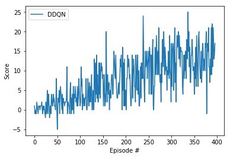

# Banana Eating Agent

## Goal

Train an agent to navigate a virtual world and collect as many yellow bananas as possible while avoiding blue bananas

## Agent Implementation

### Deep Q-Networks

This project implements a Value Based method called Deep Q-Networks. Deep Q-Learning combines classical Q-Learning with Q-table approximation using a deep feed forward neural network.

The baseline model implements 2 major training improvements (over DQN) by Deepmind and described in their [paper](https://storage.googleapis.com/deepmind-media/dqn/DQNNaturePaper.pdf):
- Experience Replay 
- Fixed Q Targets

> Reinforcement learning is known to be unstable or even to diverge when a nonlinear function approximator such as a neural network is used to represent the action-value (also known as Q) function20. This instability has several causes: the correlations present in the sequence of observations, the fact that small updates to Q may significantly change the policy and therefore change the data distribution, and the correlations
between the action-values and the target values .
We address these instabilities with a novel variant of Q-learning, which uses two key ideas. First, we used a biologically inspired mechanism termed experience replay that randomizes over the data, thereby removing correlations in the observation sequence and smoothing over changes in the data distribution. Second, we used an iterative update that adjusts the action-values towards target values that are only periodically updated, thereby reducing correlations with the target.

Moreover, we extend the experimentation to include:
- [Double Q-Learning](https://arxiv.org/abs/1509.06461) (DDQN): To prevent the over-estimation of Q-values
- [Dueling DQN](https://arxiv.org/abs/1511.06581) and Dueling DDQN
- [Prioritized Experience Replay](https://arxiv.org/abs/1511.05952) (PER)

### Base Algorithm


Source: [Deep Reinforcement Learning Nanodegree](https://www.udacity.com/course/deep-reinforcement-learning-nanodegree--nd893)


### Code implementation

The code was modified from the "Lunar Lander" tutorial from a previous lesson in the nanodegree.

The modifications are as follows:
- model.py: This file implements the Q-Network with both the standard feed forward architecture and the dueling architecture.
  - The standard architecture consists of 3 linear layers with ReLU activations
  - The dueling architecture has 2 linear layers and 2 output layers, one for the state values and one for advantage values
  
- agent.py: This file implements the learning agent itself along with the (prioritized) replay buffer.
  - The first modification was to implement Double DQN by using the network to find the argmax of the actions first, then use these action actions to determine the target values.
  - The second one was *prioritized* replay buffer in which the priority was defined as the error between the expected and target Q-values. The selection is done by creating a probability distribution 

The rest of the code remains nearly unchanged.

### DQN parameters and results

The DQN agent uses the following parameters values (defined in dqn_agent.py)

```
BUFFER_SIZE = int(1e5)  # replay buffer size
BATCH_SIZE = 64         # minibatch size 
GAMMA = 0.995           # discount factor 
TAU = 1e-3              # for soft update of target parameters
LR = 5e-4               # learning rate 
UPDATE_EVERY = 4        # how often to update the network
```

We tested the following architectures and their results are reported in the [notebook](Navigation.ipynb):
- DQN
- Dueling DQN
- DDQN
- Dueling DDQN
- DDQN + PER

The best results were obtained using the DDQN (vanilla) model:



The agent is able to obtain +13.0 average reward for 100 episode **in only under 300 episodes**.

Also, the implementation of PER is so slow that the udacity online workspace ends the session before it converging. This behaviour needs further investigation.

### Future work

- Further investigation of PER is needed since it takes too long to converge.
- Modifying the network structure to use CNNs and learn directly from pixels.
